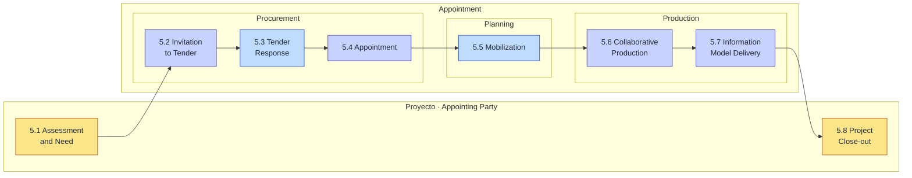
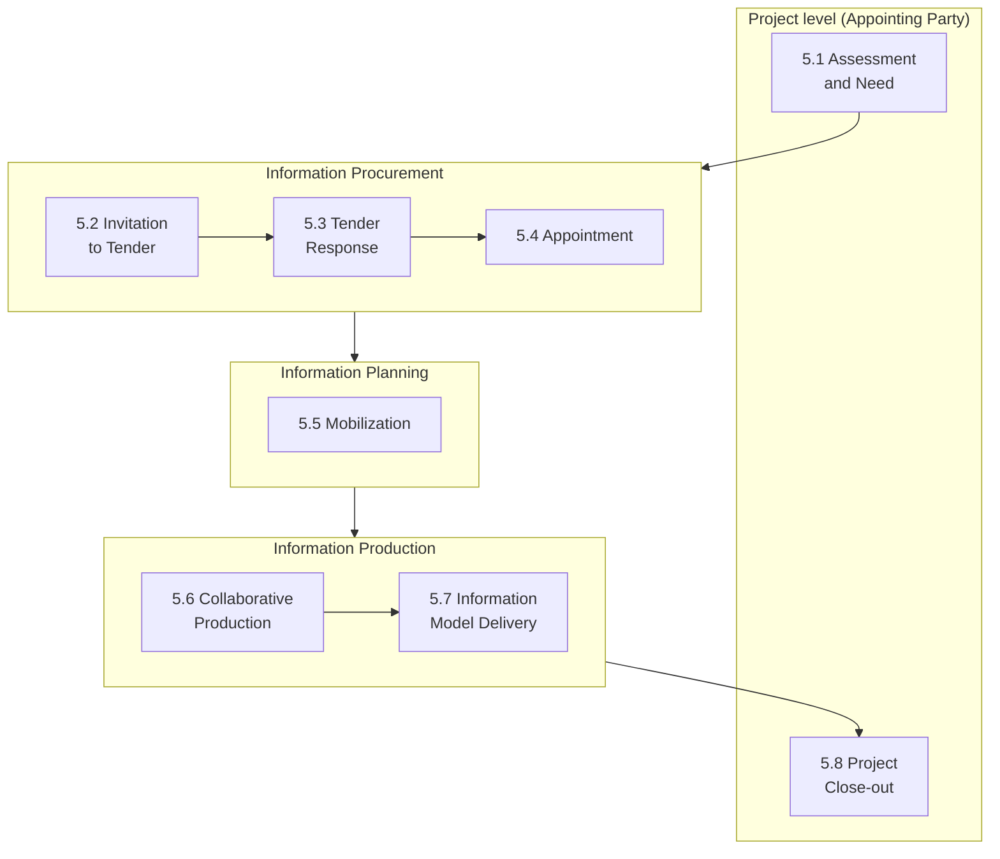

# E1 · Ciclo ISO 19650-2 · Diagrama del proceso de gestión de la información

**Fuente principal:** [UK BIM Framework — Information management according to BS EN ISO 19650, Guidance Part 2: Processes for Project Delivery (4th Edition, April 2020)](https://ukbimframework.org/wp-content/uploads/2020/05/ISO19650-2Edition4.pdf)
**Norma:** BS EN ISO 19650-2:2018, Cláusula 5 — "Information management process during the delivery phase of assets"

---

## 1. Vista general · Las 8 actividades

ISO 19650-2 estructura la fase de entrega del activo en **8 actividades secuenciales** (cláusulas 5.1 a 5.8). Las actividades 1 y 8 ocurren a nivel de **proyecto** y son responsabilidad del *Appointing Party*. Las actividades 2 a 7 ocurren a nivel de **appointment** (nombramiento contractual) y se agrupan en tres macro-etapas: **procurement**, **planning** y **production**.

> Leyenda de color: **amarillo** = liderado por *Appointing Party*; **azul** = liderado por *Lead Appointed Party*; **violeta** = colaborativo entre ambos.

---

## 2. Niveles y macro-etapas

Entender **dónde ocurre cada actividad** y **bajo qué lógica de agrupación** es la clave para no confundir las 8 cláusulas. ISO 19650-2 opera en dos niveles y agrupa las actividades de nivel appointment en tres macro-etapas.

### 2.1 · Los dos niveles

#### Nivel proyecto (project level)

Es el plano global del activo: el proyecto como un todo, desde que el cliente decide construir hasta que recibe el activo terminado. Aquí solo hay **un actor con autoridad**: el *Appointing Party* (cliente / promotor / propietario del activo).

Las decisiones de nivel proyecto afectan a **todos** los contratos y a **todas** las partes contratadas. Son decisiones estructurales: qué información se va a necesitar, en qué formato, con qué estándares, y qué se hace con ella al cerrar.

En este nivel ocurren **solo dos actividades**: la **5.1 (apertura)** y la **5.8 (cierre)**. Son el marco que envuelve todo lo demás.

#### Nivel appointment / nombramiento (appointment level)

Es el plano contractual. Un *appointment* es **cada contrato individual** que el cliente firma con un *Lead Appointed Party* (típicamente el proyectista principal, el constructor principal, o ambos), y a su vez cada *Lead Appointed Party* puede subcontratar a varios *Appointed Parties* (consultores, subcontratistas, especialistas).

En un proyecto real puedes tener varios appointments en paralelo (uno con el arquitecto, otro con el constructor, otro con instalaciones) y **cada uno repite internamente las actividades 5.2 a 5.7**. Por eso la norma dice que estas actividades ocurren *por appointment*, no una sola vez por proyecto.

> **Idea clave:** las actividades 5.1 y 5.8 se hacen **una vez** por proyecto. Las 5.2 a 5.7 se hacen **N veces**, una por cada nombramiento que se firme. Esto es lo que da a la norma su carácter modular y escalable.

### 2.2 · Las tres macro-etapas (dentro del nivel appointment)

Las actividades 5.2 a 5.7 se agrupan en tres bloques con lógica propia:

#### Procurement (aprovisionamiento) · 5.2 + 5.3 + 5.4

Fase de **selección y adjudicación**: el cliente define qué necesita, lo saca a licitación, los candidatos responden, y se elige y formaliza al ganador. Termina cuando el contrato está firmado.

Es decir: **antes de empezar a producir información de verdad, se han establecido contractualmente las reglas del juego** (EIR aceptado, BEP confirmado, MIDP/TIDPs publicados).

#### Planning (planificación) · 5.5

Una vez firmado el contrato, el equipo ganador **moviliza recursos y se prepara para producir**: equipo asignado, herramientas configuradas, plataformas de intercambio operativas, métodos y procedimientos documentados y testeados.

Es la transición de "lo que prometimos en la oferta" a "estamos listos para empezar a entregar". Bloque corto en duración pero crítico: los fallos no detectados aquí se amplifican en producción.

#### Production (producción) · 5.6 + 5.7

Donde realmente **se genera y entrega la información del modelo**: modelado, coordinación, revisiones, aprobaciones, entregas formales al cliente. Es el bloque más largo del proyecto y donde se consumen la mayoría de las horas y del coste.

Termina cuando todos los hitos contractuales del *information delivery milestone schedule* han sido aceptados.

### 2.3 · Resumen mental en una tabla

| Bloque                       | Nivel       | Actividades         | Mantra de una línea               |
| ---------------------------- | ----------- | ------------------- | --------------------------------- |
| **Apertura**                 | Proyecto    | 5.1                 | "Defino qué información necesito" |
| **Procurement**              | Appointment | 5.2 · 5.3 · 5.4     | "Pido, me responden, firmo"       |
| **Planning**                 | Appointment | 5.5                 | "Me preparo antes de producir"    |
| **Production**               | Appointment | 5.6 · 5.7           | "Produzco y entrego"              |
| **Cierre**                   | Proyecto    | 5.8                 | "Archivo y aprendo"               |

---

## 3. Detalle por actividad

### 5.1 · Assessment and Need

**Líder:** Appointing Party.
**Propósito:** sentar las bases informacionales del proyecto antes de licitar.
**Salidas clave:**

- Nombramiento de la *information management function*.
- Definición de OIR, AIR, PIR.
- Borrador de **EIR** (Exchange Information Requirements).
- Definición del **information standard** del proyecto.
- Establecimiento del **CDE inicial** y del **information protocol**.
- Identificación de reference information y shared resources.

### 5.2 · Invitation to Tender

**Líder:** Appointing Party.
**Propósito:** empaquetar la información de licitación.
**Salidas clave:**

- Compilación del paquete de licitación (EIR + information standard + protocol).
- Definición de **tender response requirements** y criterios de evaluación.
- Emisión de la licitación a los candidatos.

### 5.3 · Tender Response

**Líder:** prospectivo Lead Appointed Party.
**Propósito:** demostrar capacidad y proponer cómo se va a cumplir el EIR.
**Salidas clave:**

- **Pre-appointment BEP**.
- Evaluación de capability & capacity del delivery team.
- **Mobilization plan** propuesto.
- **Risk register** del delivery team.
- Envío de la oferta (tender submission).

### 5.4 · Appointment

**Líder:** colaborativo (Appointing Party adjudica; Lead Appointed Party formaliza).
**Propósito:** convertir la oferta ganadora en contrato vivo y plan ejecutable.
**Salidas clave:**

- Confirmación del **BEP definitivo** (post-appointment BEP).
- **Detailed responsibility matrix** del delivery team.
- **TIDPs** (uno por Task Team).
- **MIDP** consolidado por el Lead Appointed Party.
- Documentos de appointment firmados.

### 5.5 · Mobilization

**Líder:** Lead Appointed Party.
**Propósito:** comprobar que todo el equipo y la tecnología están listos antes de producir.
**Salidas clave:**

- Movilización de recursos humanos.
- Movilización de IT y del **CDE operativo**.
- Test de los **information production methods and procedures** (plantillas, naming, clasificación, exports IFC, etc.).

### 5.6 · Collaborative Production of Information

**Líder:** colaborativo (Task Teams producen, Lead Appointed Party coordina).
**Propósito:** generar los **information containers** dentro del CDE siguiendo BEP y MIDP.
**Salidas clave:**

- Comprobación de shared resources disponibles.
- Generación de información (modelos IFC, documentos, hojas de cálculo...).
- **QA check** por cada Task Team.
- **Review and approval for sharing** (paso de estado WIP → Shared).
- **Information Model Review** federada.

### 5.7 · Information Model Delivery

**Líder:** colaborativo, con doble bucle de autorización.
**Propósito:** entregar formalmente el PIM al Appointing Party.
**Salidas clave:**

- Submission del Information Model por el Appointed Party al Lead Appointed Party.
- **Authorization** del Lead Appointed Party.
- Submission al Appointing Party para **acceptance**.
- Si se acepta, paso al estado **Published** en el CDE.

### 5.8 · Project Close-out

**Líder:** Appointing Party.
**Propósito:** cerrar el proyecto y conservar lo aprovechable a largo plazo.
**Salidas clave:**

- **Archive del PIM** completo en el CDE (estado *Archive*).
- Extracción del subconjunto relevante para alimentar el **AIM**.
- Recopilación de **lessons learnt** con cada Lead Appointed Party.

---

## 4. Matriz de responsabilidades por fase

Codificación: **L** = Lidera · **C** = Colabora · **I** = Informado · **—** = No interviene formalmente.

| Fase                              | Appointing Party | Lead Appointed Party  | Task Team / Appointed Party |
| --------------------------------- | ---------------- | --------------------- | --------------------------- |
| 5.1 Assessment and Need           | **L**            | —                     | —                           |
| 5.2 Invitation to Tender          | **L**            | I (recibe invitación) | —                           |
| 5.3 Tender Response               | C (evalúa)       | **L**                 | C (aporta capability)       |
| 5.4 Appointment                   | C (adjudica)     | **L** (confirma BEP)  | C (firma sub-appointment)   |
| 5.5 Mobilization                  | I                | **L**                 | C (se moviliza)             |
| 5.6 Collaborative Production      | I (revisa CDE)   | **L** (coordina)      | **L** (produce)             |
| 5.7 Information Model Delivery    | C (acepta)       | **L** (autoriza)      | C (entrega al LAP)          |
| 5.8 Project Close-out             | **L** (archiva)  | C (lessons learnt)    | —                           |

---

## 5. Vista alternativa · Sub-procesos del appointment

Esta vista refuerza el agrupamiento canónico de ISO 19650-2 cláusula 5:

---

## 6. Cómo encaja con los términos del glosario E1

- **OIR / AIR / PIR / EIR** → se definen y refinan en la actividad 5.1 y se empaquetan en 5.2.
- **BEP** → propuesto en 5.3 (pre-appointment) y confirmado en 5.4 (post-appointment).
- **MIDP / TIDP** → consolidados en 5.4.
- **CDE** → inicializado en 5.1, operativo en 5.5, en producción durante 5.6–5.7, archivado en 5.8.
- **PIM** → producido durante 5.6–5.7.
- **AIM** → alimentado en 5.8 a partir del PIM aceptado.
- **LOIN** → criterio transversal aplicado en todas las actividades de planificación y producción.

---

## 7. Diagrama linear para citar en el glosario principal

Versión compacta que puedes embeber directamente en `E1_glosario_iso19650.md`:

---

## Fuentes citadas

- **Fuente normativa primaria:** [BS EN ISO 19650-2:2018, Cláusula 5](https://www.iso.org/standard/68080.html).
- **Guía oficial:** [UK BIM Framework, Guidance Part 2 — Edition 4 (2020), PDF](https://ukbimframework.org/wp-content/uploads/2020/05/ISO19650-2Edition4.pdf).
- **Guía complementaria:** [UK BIM Framework, Guidance Part A — Information management function and resources (2020)](https://www.ukbimframework.org/wp-content/uploads/2021/02/Guidance-Part-A_The-information-management-function-and-resources_Edition-2.pdf).
- **Resumen externo verificado:** [GlobalCAD · ISO 19650-2 delivery phase](https://globalcad.co.uk/iso-19650-2-the-delivery-phase-of-assets/).
