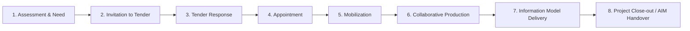

# E1 · Glosario ISO 19650

**Entregable:** S1·S — sábado 16/05/2026
**Mínimo:** ≥ 12 términos con definición ES/EN, contexto de uso y fuente verificable.

---

## 1. EIR — Exchange Information Requirements

**EN:** *Specification for what information is to be produced, when it is to be produced, by what methods and procedures, and to what standard.*
**ES:** Requisitos de Intercambio de Información — documento contractual que define qué información debe entregarse, cuándo, cómo y bajo qué estándares.

**Contexto de uso:** lo redacta el *Appointing Party* y se entrega al *Lead Appointed Party* como parte de los documentos de licitación. Es la base sobre la que se construye el BEP.

**No confundir con:** OIR (a nivel organización) ni PIR (a nivel proyecto).

**Fuente:**

---

## 2. BEP — BIM Execution Plan

**EN:** *Plan prepared by the suppliers to explain how the information management aspects of the appointment will be carried out.*
**ES:** Plan de Ejecución BIM — documento donde el *Lead Appointed Party* describe cómo va a cumplir el EIR: roles, software, procesos, hitos, federación de modelos.

**Contexto de uso:** dos versiones — *pre-appointment BEP* (en respuesta a la licitación) y *delivery BEP* (tras adjudicación, refinado y firmado).

**Fuente:**

---

## 3. CDE — Common Data Environment

**EN:** *Agreed source of information for any given project or asset, for collecting, managing and disseminating each information container through a managed process.*
**ES:** Entorno Común de Datos — repositorio único acordado donde se gestionan todos los contenedores de información del proyecto a lo largo de 4 estados: WIP, Shared, Published, Archive.

**Ejemplos de implementación:** Autodesk Construction Cloud, Speckle, Trimble Connect, Bentley ProjectWise, BIMcollab Nexus.

**Fuente:**

---

## 4. LOIN — Level of Information Need

**EN:** *Framework which defines the extent and granularity of information needed to fulfil each information requirement.*
**ES:** Nivel de Necesidad de Información — marco que sustituye y supera al antiguo LOD (Level of Development) anglosajón. Define la información geométrica, alfanumérica y documental necesaria por elemento, propósito y fase.

**Tres dimensiones:** geometrical information, alphanumerical information, documentation.

**Norma específica:** EN 17412-1:2020.

**Fuente:**

---

## 5. AIM — Asset Information Model

**EN:** *Information model relating to the operational phase of an asset.*
**ES:** Modelo de Información del Activo — modelo que da soporte a la fase de operación y mantenimiento, una vez entregado el activo al *Appointing Party*.

**Contexto de uso:** se nutre del PIM en la entrega final del proyecto y se mantiene vivo durante toda la vida útil del activo.

**Fuente:**

---

## 6. PIM — Project Information Model

**EN:** *Information model relating to the delivery phase of a project.*
**ES:** Modelo de Información del Proyecto — modelo que se construye y gestiona durante la fase de diseño y construcción, hasta el handover.

**Transición:** al cierre del proyecto, el subconjunto relevante del PIM se transfiere al AIM.

**Fuente:**

---

## 7. Appointing Party

**EN:** *Receiver of information concerning works, goods or services from a lead appointed party.*
**ES:** Parte Designante — quien encarga el proyecto, redacta el EIR y recibe los entregables. Equivale al antiguo *Employer* o *Client*.

**Responsabilidades:** definir OIR/PIR/EIR, establecer el CDE inicial, aprobar el BEP.

**Fuente:**

---

## 8. Lead Appointed Party

**EN:** *Provider of information for works, goods or services to an appointing party, who appoints further parties for delivery.*
**ES:** Parte Designada Principal — contratista principal o coordinador BIM contratado que responde al *Appointing Party* y subcontrata a los *Appointed Parties*.

**Responsabilidades:** preparar el BEP, montar el MIDP a partir de los TIDPs, garantizar la federación y entrega.

**Fuente:**

---

## 9. Task Team / Appointed Party

**EN:** *Group assembled to perform a specific task; appointed party provides information for works, goods or services to a lead appointed party.*
**ES:** Equipo de Tarea / Parte Designada — cada disciplina o subcontratista que produce información para una entrega específica (estructura, MEP, arquitectura, etc.).

**Relación:** cada *Task Team* prepara su propio TIDP, que el *Lead Appointed Party* agrega en el MIDP.

**Fuente:**

---

## 10. MIDP — Master Information Delivery Plan

**EN:** *Plan that incorporates all relevant task information delivery plans.*
**ES:** Plan Maestro de Entrega de Información — agregación de todos los TIDPs en un único plan que muestra qué información se entrega, por quién, cuándo y en qué formato a lo largo del proyecto.

**Lo mantiene:** *Lead Appointed Party*.

**Fuente:**

---

## 11. TIDP — Task Information Delivery Plan

**EN:** *Plan of information deliverables prepared by a task team for its scope of work.*
**ES:** Plan de Entrega de Información por Equipo de Tarea — plan individual de cada *Task Team* que detalla qué entregables produce, en qué hito y bajo qué LOIN.

**Lo mantiene:** cada *Task Team* responsable.

**Fuente:**

---

## 12. OIR — Organizational Information Requirements

**EN:** *Information requirements in relation to organizational objectives.*
**ES:** Requisitos de Información Organizacional — información que necesita la organización en su conjunto, independientemente de un proyecto concreto. Alimenta a los AIR (Asset Information Requirements) y a los EIR.

**Cadena de requisitos:** OIR → AIR → PIR → EIR.

**Fuente:**

---

## Términos extra (opcional, suman puntos)

### 13. PIR — Project Information Requirements

**EN:** *Information required to answer or inform high-level strategic objectives in relation to a particular built asset project.*
**ES:** Requisitos de Información del Proyecto — información estratégica que el *Appointing Party* necesita en cada hito clave del proyecto.

**Fuente:**

---

### 14. AIR — Asset Information Requirements

**EN:** *Information requirements in relation to the operation of an asset.*
**ES:** Requisitos de Información del Activo — qué información se necesita para operar y mantener el activo una vez construido.

**Fuente:**

---

### 15. Information Container

**EN:** *Named persistent set of information retrievable from a file, system or application storage hierarchy.*
**ES:** Contenedor de Información — unidad mínima de información gestionada en el CDE: puede ser un IFC, un PDF, una hoja de cálculo, etc. Tiene un código único y estados (WIP/Shared/Published/Archive).

**Fuente:**

---

## Diagrama del ciclo ISO 19650-2 (entregable adicional)

> Insertar aquí imagen del ciclo (`E1_ciclo_iso19650.jpg` o diagrama Mermaid).

**Roles por fase:**

| Fase | Appointing Party | Lead Appointed Party | Task Team |
| ---- | ---------------- | -------------------- | --------- |
| 1    | …                | —                    | —         |
| 2    | …                | —                    | —         |
| 3    | (revisa)         | …                    | …         |
| 4    | …                | …                    | —         |
| 5    | (recibe)         | …                    | …         |
| 6    | (revisa CDE)     | …                    | …         |
| 7    | (acepta)         | …                    | …         |
| 8    | (custodia AIM)   | (cierra PIM)         | —         |

---

## Dudas para profundizar (rellenar durante S1·L y S1·X)

1.
2.
3.

---

## Fuentes consultadas

- [buildingSMART · OpenBIM](https://www.buildingsmart.org/about/openbim/)
- [UK BIM Framework — Guidance documents](https://ukbimframework.org/resources/)
- [IFC overview · buildingSMART](https://www.buildingsmart.org/standards/bsi-standards/industry-foundation-classes/)
- *(añadir aquí cualquier otra que uses)*

---

## Criterios de aceptación (autocomprobación sábado)

- [ ] ≥ 12 términos definidos con ES + EN
- [ ] Cada término tiene **Fuente** rellenada con URL o documento concreto
- [ ] Diagrama del ciclo ISO 19650-2 incluido (imagen o Mermaid)
- [ ] Tabla de roles por fase completada
- [ ] 3 dudas anotadas para resolver
- [ ] Commit + push al repo `openbim-12w`
