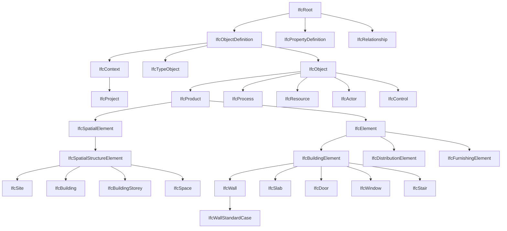
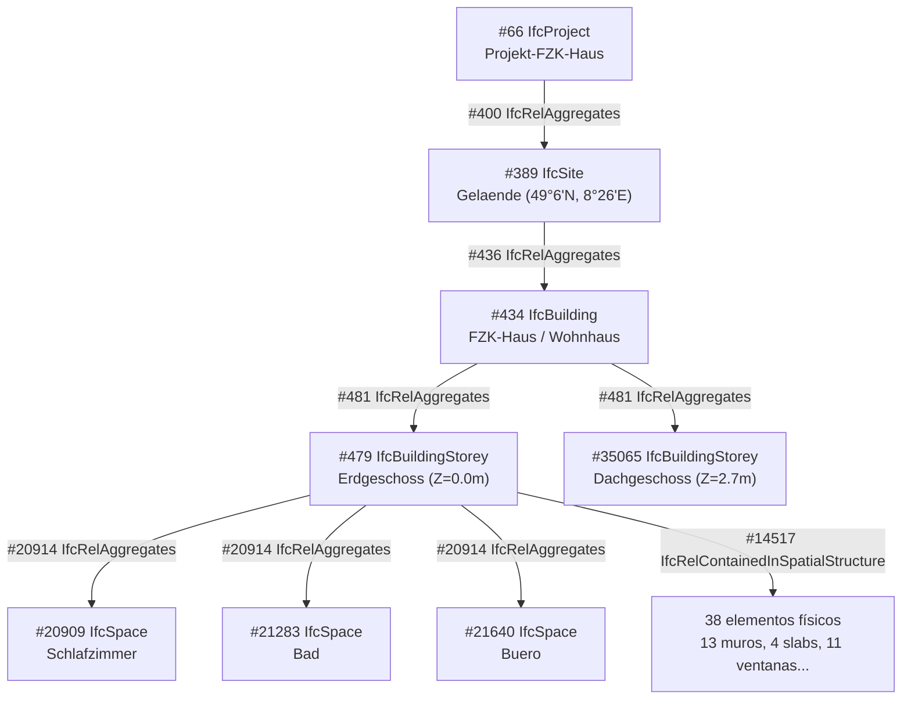

# S3·L — IFC schema: jerarquía y relaciones

**Sesión:** S3·L (semana 3, lunes) · 25/05/2026
**Plan formativo:** OpenBIM 12 semanas (11/05/2026 – 01/08/2026)
**Schema base:** IFC4 (IFC4 ADD2 TC1)
**Notas comparativas:** IFC4.3 ADD2 cuando aporten
**Modelo de referencia:** `AC20-FZK-Haus.ifc` (KIT/IAI, SHA-256 `70cc8ff2…77994`)
**Autor:** José M. Soria · NEXUM Developments
**Versión doc:** 0.1
**Estado:** borrador de sesión, abierto a revisión en S3·X

> Objetivo de S3·L: consolidar el modelo conceptual de IFC (objetos, tipos, propiedades y relaciones) para poder “leer” un IFC sin depender de la herramienta. Al terminar, debes ser capaz de abrir el `.ifc` en un editor de texto y reconstruir mentalmente el árbol espacial y la decoración semántica del modelo.

---

## 0. Cómo usar este documento

Este documento se complementa con dos artefactos hermanos:

- `S3L_ifc_relaciones.md` (Bloque B) — las 5 relaciones que mueven IFC + 3 secundarias
- `S3L_ifc_glosario.md` (Bloque C) — mini-glosario de 40 términos y `scripts/s3l_ifc_inspect.py` (pseudocódigo, Nivel 2)

Convenciones:
- Las **entidades IFC** se escriben en MAYÚSCULAS cuando refieren al tipo STEP (`IFCWALL`) y en PascalCase cuando refieren al concepto del schema (`IfcWall`). Son lo mismo.
- Los **números STEP** (`#66`, `#389`…) referencian líneas reales del fichero `AC20-FZK-Haus.ifc` v1 (SHA arriba). Cualquier discrepancia indica que has descargado otro fichero.
- Los términos clave en cursiva la primera vez que aparecen.

---

## 1. Fundamentos del modelo IFC

### 1.1 · Qué es IFC

IFC (**Industry Foundation Classes**) es un **schema de datos abierto** desarrollado por buildingSMART International para describir información de construcción. No es un formato de fichero — es un *modelo conceptual* expresado en **EXPRESS** (ISO 10303-11), que se serializa habitualmente como:

| Serialización | Extensión | Notas |
|---|---|---|
| STEP Physical File (SPF, ISO 10303-21) | `.ifc` | La que ves cuando abres con editor de texto. Ejemplo: FZK-Haus. |
| ifcXML | `.ifcxml` | XML, más verboso, casi no se usa. |
| ifcJSON | `.ifcjson` | JSON, en evolución, útil para webapps. |
| ifcZIP | `.ifczip` | Cualquiera de las anteriores comprimida. |
| ifcHDF5 | `.ifchdf5` | Experimental, optimizado para grandes modelos. |

Todas comparten el mismo schema EXPRESS subyacente. Lo que cambia es la sintaxis de serialización.

### 1.2 · Versiones del schema IFC

| Versión | Año | Notas relevantes |
|---|---|---|
| IFC2x3 TC1 | 2007 | Dominante 2007–2017. Aún muy usado en producción (Revit por defecto hasta hace poco). |
| **IFC4 ADD2 TC1** | 2017 | **Base de esta sesión.** Schema moderno estándar. ISO 16739-1:2018. |
| IFC4.1 | 2018 | Añadidos menores (cobertura de alineamientos para infra). |
| IFC4.2 | 2019 | Dragado, puentes preliminar. |
| **IFC4.3 ADD2** | 2024 | **Infraestructura completa** (ferrocarril, carreteras, puentes, puertos). ISO 16739-1:2024. Anotaciones “IFC4.3 →” en este documento marcan diferencias. |
| IFC4.4 / IFC5 | en desarrollo | Sin uso productivo aún. |

**Regla práctica NEXUM (decisión S2·L):** la plantilla `NEXUM_CanCabassa.rte` exportará IFC4 por defecto. Migrar a IFC4.3 solo cuando el proyecto incluya elementos de infraestructura no cubiertos por IFC4 (carreteras, ferrocarril, etc.).

### 1.3 · Las 4 piezas del modelo

Cuando lees un IFC, todo lo que ves cae en una de estas 4 categorías:

| Pieza | Qué es | Ejemplos |
|---|---|---|
| **Entidad** (entity) | Una clase del schema. Instanciable. | `IfcWall`, `IfcDoor`, `IfcSpace` |
| **Tipo** (type) | Plantilla compartida por varias entidades del mismo tipo. | `IfcWallType`, `IfcDoorType` |
| **Propiedad** (property) | Dato asociado a una entidad mediante un *property set* (`Pset`). | `Pset_WallCommon.IsExternal=TRUE` |
| **Relación** (relationship) | Entidad cuyo único propósito es **conectar** otras entidades. Empiezan por `IfcRel...`. | `IfcRelAggregates`, `IfcRelDefinesByProperties` |

**Idea central:** en IFC **las relaciones son entidades de primera clase**. Si quieres saber qué muro está en qué planta, no buscas un atributo del muro — buscas un `IfcRelContainedInSpatialStructure` que los conecta. Esto es contraintuitivo viniendo de modelos orientados a objetos tradicionales, pero es lo que hace a IFC tan flexible.

---

## 2. Las tres jerarquías que coexisten en un IFC

Este es el concepto más confundido. Cuando alguien dice “la jerarquía IFC”, puede referirse a **tres cosas distintas** que conviven en el mismo fichero:

| # | Jerarquía | Naturaleza | Mecanismo |
|---|---|---|---|
| 1 | **Jerarquía de clases** | Estática, del schema | Herencia EXPRESS (`SUBTYPE OF`) |
| 2 | **Jerarquía espacial** | Dinámica, del modelo | Entidades `IfcSpatialStructureElement` + relación `IfcRelAggregates` |
| 3 | **Jerarquía de descomposición/contención** | Dinámica, del modelo | Relaciones `IfcRelAggregates`, `IfcRelNests`, `IfcRelContainedInSpatialStructure` |

Las tres responden a preguntas distintas:

| Pregunta | Jerarquía aplicable |
|---|---|
| “¿De qué clase abstracta deriva `IfcWall`?” | Jerarquía 1 (clases) |
| “¿En qué planta está esta puerta?” | Jerarquía 3 (contención espacial) |
| “¿Qué partes componen este IfcStair?” | Jerarquía 3 (descomposición vía `IfcRelAggregates`) |
| “¿Qué edificios pertenecen al proyecto?” | Jerarquía 2 + 3 (espacial agregada por relación) |

Las desarrollo abajo en orden.

---

## 3. Jerarquía 1 — Clases (herencia EXPRESS)

Es **estática**: no cambia entre modelos. Cualquier IFC válido respeta esta jerarquía.

### 3.1 · La raíz universal: `IfcRoot`

Toda entidad “con identidad propia” en IFC hereda de **`IfcRoot`**. `IfcRoot` define los 4 atributos que comparten **todas** las entidades importantes:

| # | Atributo | Tipo | Descripción |
|---|---|---|---|
| 1 | `GlobalId` | `IfcGloballyUniqueId` | GUID base64 de 22 caracteres. Único en el mundo. **El identificador estable** del objeto. |
| 2 | `OwnerHistory` | `IfcOwnerHistory` | Quién creó/modificó la entidad y cuándo. |
| 3 | `Name` | `IfcLabel` | Nombre legible (opcional). |
| 4 | `Description` | `IfcText` | Descripción libre (opcional). |

> **Regla NEXUM:** `StoreIFCGUID=true` en el export Revit (decisión S2·L) garantiza que el `GlobalId` se mantiene estable entre exportaciones. Sin esa opción, Revit genera GUIDs nuevos en cada export y rompe la trazabilidad.

### 3.2 · Las 3 ramas principales bajo `IfcRoot`

```
IfcRoot (ABSTRACT)
├── IfcObjectDefinition (ABSTRACT) ........ "Cosas": tienen presencia en el modelo
│   ├── IfcObject ..................... Instancias concretas (un muro, una puerta...)
│   ├── IfcTypeObject ................. Tipos/plantillas (la familia "Muro 20cm")
│   └── IfcContext .................... Contexto raíz (IfcProject, IfcProjectLibrary)
├── IfcPropertyDefinition (ABSTRACT) ...... "Decoración": properties y conjuntos
│   ├── IfcPropertySetDefinition ...... PropertySets (Psets) y quantities
│   └── IfcPropertyTemplateDefinition . Plantillas de Psets (IFC4+)
└── IfcRelationship (ABSTRACT) ............ "Conexiones": relaciones entre objetos
    ├── IfcRelDecomposes .............. Composición/agregación (IfcRelAggregates, IfcRelNests)
    ├── IfcRelConnects ................ Conectividad física (puertas a paredes, etc.)
    ├── IfcRelAssigns ................. Asignación a actores/recursos/grupos
    ├── IfcRelDefines ................. Decoración con tipos o properties
    └── IfcRelDeclares ................ Declaración en contexto (IFC4+)
```

**Las 3 ramas (Objeto / Property / Relación) son ortogonales.** Eso es lo que da flexibilidad a IFC: un mismo `IfcWall` puede estar conectado a:
- Una `IfcWallType` por `IfcRelDefinesByType` (decoración con tipo)
- Un `Pset_WallCommon` por `IfcRelDefinesByProperties` (decoración con properties)
- Una `IfcBuildingStorey` por `IfcRelContainedInSpatialStructure` (contención espacial)
- Una `IfcOpeningElement` por `IfcRelVoidsElement` (huecos)
- Un `IfcWindow` por `IfcRelFillsElement` (relleno del hueco)

Cinco relaciones distintas, todas pegadas al mismo muro. Eso es IFC.

### 3.3 · La rama crítica: `IfcObject → IfcProduct → IfcElement`

```
IfcObject (ABSTRACT)
├── IfcProduct (ABSTRACT) ............... Objeto con representación geométrica y/o ubicación
│   ├── IfcSpatialElement (ABSTRACT) .... Estructura espacial
│   │   └── IfcSpatialStructureElement
│   │       ├── IfcSite
│   │       ├── IfcBuilding
│   │       ├── IfcBuildingStorey
│   │       ├── IfcSpace
│   │       └── IFC4.3 → IfcFacility, IfcFacilityPart (infra)
│   ├── IfcElement (ABSTRACT) ........... Objeto físico construible
│   │   ├── IfcBuildingElement (ABSTRACT)
│   │   │   ├── IfcWall (concrete)
│   │   │   │   └── IfcWallStandardCase ← FZK-Haus usa esta
│   │   │   ├── IfcSlab
│   │   │   ├── IfcColumn
│   │   │   ├── IfcBeam
│   │   │   ├── IfcDoor
│   │   │   ├── IfcWindow
│   │   │   ├── IfcRoof
│   │   │   ├── IfcStair / IfcStairFlight
│   │   │   ├── IfcRailing
│   │   │   ├── IfcCovering
│   │   │   └── ... ~25 más
│   │   ├── IfcDistributionElement (ABSTRACT) ... MEP
│   │   │   ├── IfcFlowSegment (tuberías, ductos)
│   │   │   ├── IfcFlowFitting (codos, tees)
│   │   │   ├── IfcFlowTerminal (luces, grifos, difusores)
│   │   │   └── ... 50+ subtipos
│   │   ├── IfcFurnishingElement (mobiliario)
│   │   ├── IfcGeographicElement (terreno, paisaje)
│   │   └── IfcVirtualElement (entidades sin representación física)
│   ├── IfcStructuralActivity / IfcStructuralItem (análisis estructural)
│   ├── IfcAnnotation (anotaciones 2D)
│   ├── IfcGrid, IfcGridAxis (ejes)
│   └── IfcProxy (objeto no clasificable)
├── IfcProcess (ABSTRACT) ............... Eventos, tareas (planificación 4D)
├── IfcResource (ABSTRACT) .............. Materiales, equipos, mano de obra (5D)
├── IfcControl (ABSTRACT) ............... Permisos, restricciones
└── IfcActor (ABSTRACT) ................. Personas, organizaciones
```

Notas sobre el árbol:
- **ABSTRACT** = no instanciable. Nunca verás `#XXX= IFCBUILDINGELEMENT(...)` en un IFC. Solo verás sus subtipos concretos (`IFCWALL`, `IFCSLAB`, etc.).
- **`IfcWallStandardCase` vs `IfcWall`:** son ambos concretos. El `StandardCase` es un subtipo que **promete** que la geometría puede deducirse de un eje + perfil + altura (es decir, un muro extrudido simple). Si tienes un muro curvo, con huecos complejos, o multicapa raro, se usa `IfcWall` directamente. **En FZK-Haus los 13 muros son `IfcWallStandardCase`.**
- Las clases concretas frecuentes en edificación están en `IfcBuildingElement`. MEP cuelga de `IfcDistributionElement`. Mobiliario de `IfcFurnishingElement`.

### 3.4 · La idea de “Object vs Type”

IFC distingue siempre instancia y tipo:

| Concepto | Instancia (`IfcObject`) | Tipo (`IfcTypeObject`) |
|---|---|---|
| Ejemplo | "El muro del salón, planta 1" | "Muro M-20-LP (Pladur 2x15 + lana 70 + ladrillo 11.5)" |
| Geometría | Específica de esa instancia | Compartida por todas las instancias |
| Properties | Pueden sobreescribir al tipo | Comunes a todas las instancias |
| Relación | `IfcWall` | `IfcWallType` |
| Conector | `IfcRelDefinesByType` |

En Revit: la **familia** es el `IfcTypeObject`, la **instancia colocada** es el `IfcObject`. **Esta dualidad existe en TODOS los elementos.**

---

## 4. Jerarquía 2 — Espacial estándar

Es **dinámica** (depende del modelo) pero su **estructura es prescriptiva**: IFC obliga a una pirámide concreta para el contexto edificación.

### 4.1 · La pirámide IFC4 estándar (edificación)

```
IfcProject                       (uno y solo uno por fichero)
   │ IfcRelAggregates
   ▼
IfcSite                          (uno o varios)
   │ IfcRelAggregates
   ▼
IfcBuilding                      (uno o varios)
   │ IfcRelAggregates
   ▼
IfcBuildingStorey                (una o varias plantas)
   │ IfcRelAggregates
   ▼
IfcSpace                         (cero o varios espacios)
```

Reglas duras del schema:
- `IfcProject` es **único** en todo el fichero. Es el contexto raíz.
- Los `IfcRelAggregates` entre niveles son **obligatorios** para que el modelo sea “válido espacialmente”.
- Saltarse niveles (proyecto → planta sin sitio ni edificio) es técnicamente legal pero rompe la mayoría de validadores y herramientas.

### 4.2 · IFC4.3 → ampliación para infraestructura

IFC4.3 añade `IfcFacility` y `IfcFacilityPart` por debajo de `IfcSite`, sin tocar el resto:

```
IfcSite
   │ IfcRelAggregates
   ▼
IfcFacility (ABSTRACT, IFC4.3+)
   ├── IfcBuilding         (edificación: igual que IFC4)
   ├── IfcBridge           (puentes)
   ├── IfcRoad             (carreteras)
   ├── IfcRailway          (ferrocarril)
   ├── IfcMarineFacility   (puertos, marinas)
   └── IfcTunnel           (túneles, futuro)
       │ IfcRelAggregates
       ▼
IfcFacilityPart (subtipos según facility)
```

**Implicación para NEXUM:** mientras todos los proyectos sean Living/edificación (Can Cabassa, PBSA, etc.), IFC4 vale. Cuando aparezca el primer proyecto con infraestructura no edificable (urbanización compleja, viario, puente peatonal), evaluar migración a IFC4.3.

### 4.3 · El elemento que NO sale en la pirámide: `IfcElement`

Los elementos físicos (muros, puertas…) **NO están en la pirámide espacial**. Cuelgan de ella mediante una relación distinta:

```
IfcBuildingStorey
   │ IfcRelContainedInSpatialStructure  ◄── relación distinta de IfcRelAggregates
   ▼
IfcWall, IfcDoor, IfcSlab, IfcWindow, ...
```

**Distinción clave:**
- `IfcRelAggregates`: pirámide espacial (Project→Site→Building→Storey→Space) y descomposición de elementos (Stair → StairFlights).
- `IfcRelContainedInSpatialStructure`: anclaje de elementos físicos en niveles de la pirámide.

Esta distinción aparece en Bloque B con detalle.

---

## 5. Jerarquía 3 — Descomposición y contención (las relaciones)

Las relaciones IFC que “construyen” la estructura del modelo se reducen a unas pocas familias. Las 3 imprescindibles aquí; las completas en `S3L_ifc_relaciones.md`.

### 5.1 · `IfcRelAggregates`

Composición *whole-part*. Conecta un **padre** (el todo) con sus **hijos** (las partes).

**Sintaxis STEP:**
```
IFCRELAGGREGATES(GlobalId, OwnerHistory, Name, Description, RelatingObject, RelatedObjects)
```

Donde `RelatingObject` es el padre y `RelatedObjects` es una lista de hijos.

**Uso 1 — pirámide espacial:** `IfcProject` agrega `IfcSite`s, `IfcSite` agrega `IfcBuilding`s, etc.

**Uso 2 — descomposición de elementos:** una `IfcStair` agrega varios `IfcStairFlight` y `IfcRailing`. Un `IfcCurtainWall` agrega `IfcPlate` + `IfcMember`.

### 5.2 · `IfcRelContainedInSpatialStructure`

Anclaje de elementos físicos a un nivel de la pirámide espacial.

**Sintaxis STEP:**
```
IFCRELCONTAINEDINSPATIALSTRUCTURE(GlobalId, OwnerHistory, Name, Description, RelatedElements, RelatingStructure)
```

Aquí el padre es `RelatingStructure` (el `IfcBuildingStorey` o similar) y `RelatedElements` es la lista de elementos contenidos.

**Regla:** un elemento físico solo puede estar contenido en **uno y solo un** `IfcSpatialStructureElement`. Si un muro atraviesa dos plantas, se decide convencionalmente (suele ir a la planta inferior).

### 5.3 · `IfcRelNests`

Composición ordenada. Como `IfcRelAggregates` pero **la lista de hijos tiene orden significativo** (un tramo de escalera tiene huellas ordenadas). Usado típicamente para puertas, ventanas, escaleras con partes ordenadas.

> Las otras relaciones (`IfcRelDefinesByType`, `IfcRelDefinesByProperties`, `IfcRelVoidsElement`, `IfcRelFillsElement`, `IfcRelConnectsPathElements`…) las cubre Bloque B.

---

## 6. Anatomía del FZK-Haus (recorrido por líneas reales)

A continuación, recorrido por el fichero `AC20-FZK-Haus.ifc` v1 (SHA `70cc8ff2…`) reconstruyendo la jerarquía a partir de líneas STEP concretas. Esto es **la pieza más importante de la sesión**: comprobar que lo de arriba es real, no abstracto.

### 6.1 · HEADER (líneas 1–8)

```step
ISO-10303-21;
HEADER;
FILE_DESCRIPTION(('ViewDefinition [...]','Option [...]', ...),'2;1');
FILE_NAME('S:\[IFC]\[COMPLETE-BUILDINGS]\FZK-MODELS\FZK-Haus\ArchiCAD-20\AC20-FZK-Haus.ifc',
          '2016-12-21T17:54:06',('Architect'),('Building Designer Office'),
          'The EXPRESS Data Manager Version 5.02.0100.09 : 26 Sep 2013',
          'IFC file generated by GRAPHISOFT ARCHICAD-64 20.0.0 GER FULL Windows version (IFC2x3 add-on version: 4009 GER FULL).',
          'The authorising person');
FILE_SCHEMA(('IFC4'));
ENDSEC;
```

Datos extraíbles del HEADER:
- **Schema:** `IFC4` ← objetivo de esta sesión, confirmado
- **MVD declarado:** `ViewDefinition [, QuantityTakeOffAddOnView, SpaceBoundary2ndLevelAddOnView]` — el espacio inicial vacío es una incidencia menor (lista con primer elemento vacío)
- **Originating system:** ArchiCAD 20.0.0 con add-on de export IFC2x3, reexportado a IFC4
- **Fecha:** 21/12/2016 17:54:06
- **Author:** "Architect" en "Building Designer Office" (datos genéricos del template ArchiCAD)

### 6.2 · `IfcProject` (línea 53)

```step
#66= IFCPROJECT('0lY6P5Ur90TAQnnnI6wtnb',  -- GlobalId
                #12,                         -- OwnerHistory (referencia a IFCOWNERHISTORY)
                'Projekt-FZK-Haus',          -- Name
                'Projekt FZK-House create by KHH Forschuungszentrum Karlsruhe',  -- Description
                $,$,$,                       -- ObjectType, LongName, Phase (todos $ = null)
                (#62,#374),                  -- RepresentationContexts (geometría 3D + 2D)
                #49);                        -- UnitsInContext (metros, m², m³, radianes)
```

- GUID estable: `0lY6P5Ur90TAQnnnI6wtnb`
- Nombre: `Projekt-FZK-Haus`
- Es **único** en todo el fichero (regla: 1 IfcProject por IFC)

### 6.3 · `IfcSite` (línea 213)

```step
#389= IFCSITE('0KMpiAlnb52RgQuM1CwVfd',
              #12, 'Gelaende', 'Ebenes Gelaende', 'LandUse',
              #115,            -- ObjectPlacement
              #383,            -- Representation (geometría del terreno)
              $,
              .ELEMENT.,        -- CompositionType
              (49,6,1,566000),  -- RefLatitude  = 49°6'1.566" N  (Karlsruhe)
              (8,26,11,540400), -- RefLongitude = 8°26'11.540" E
              110.,             -- RefElevation = 110 m
              $,$,$);
```

- Coordenadas reales (Karlsruhe, Alemania)
- Elevación 110 m sobre el datum
- `'Gelaende'` = "terreno" en alemán

### 6.4 · Relación `IfcProject → IfcSite` (línea 214)

```step
#400= IFCRELAGGREGATES('1GO86xgv8B470LzUwG9dnQ',
                       #12,
                       $, $,
                       #66,        -- RelatingObject = IfcProject
                       (#389));    -- RelatedObjects = [IfcSite]
```

Una sola línea STEP describe la primera arista de la pirámide.

### 6.5 · `IfcBuilding` (línea 228)

```step
#434= IFCBUILDING('2hQBAVPOr5VxhS3Jl0O47h',
                  #12, 'FZK-Haus', 'FZK-Haus create by KHH / IAI / FZK',
                  'Wohnhaus',     -- ObjectType = "casa unifamiliar"
                  #432,           -- ObjectPlacement
                  $, $,
                  .ELEMENT.,
                  $, $, $);
```

### 6.6 · Relación `IfcSite → IfcBuilding` (línea 229)

```step
#436= IFCRELAGGREGATES('0FWMHXglS7fAS5ox0icROM', #12, $, $, #389, (#434));
```

### 6.7 · `IfcBuildingStorey` (líneas 249 y 19978)

Dos plantas en el FZK-Haus:

```step
#479=   IFCBUILDINGSTOREY('2eyxpyOx95m90jmsXLOuR0', #12, 'Erdgeschoss',  $, $, #477,  $, ..., .ELEMENT., 0.);   -- Planta baja, Z=0.0m
#35065= IFCBUILDINGSTOREY('273g3wqLzDtfYIl7qqkgcO', #12, 'Dachgeschoss', $, $, #35064, $, ..., .ELEMENT., 2.7); -- Cubierta,  Z=2.7m
```

El último atributo (`Elevation`) es la cota relativa al edificio: planta baja en 0.0, planta cubierta en 2.7m.

### 6.8 · Relación `IfcBuilding → 2 IfcBuildingStorey` (línea 250)

```step
#481= IFCRELAGGREGATES('1Y0uyqfGvXQyvJl5QblObD',
                       #12, $, $,
                       #434,             -- RelatingObject = IfcBuilding
                       (#479, #35065));  -- RelatedObjects = [Erdgeschoss, Dachgeschoss]
```

### 6.9 · Espacios habitables (`IfcSpace`)

Líneas 11879, 12092, 12300… (varios):
```step
#20909= IFCSPACE('347jFE2yX7IhCEIALmupEH', #12, '4', $, $, #20819, #20904, 'Schlafzimmer', .ELEMENT., $, $);  -- Dormitorio
#21283= IFCSPACE('0e_hbkIQ5DMQlIJ$2V3j_m', #12, '3', $, $, #21203, #21278, 'Bad',          .ELEMENT., $, $);  -- Baño
#21640= IFCSPACE('2RSCzLOBz4FAK$_wE8VckM', #12, '2', $, $, #21560, #21635, 'Buero',        .ELEMENT., $, $);  -- Oficina
```

### 6.10 · Relación `IfcBuildingStorey → IfcSpaces` (línea 11880)

```step
#20914= IFCRELAGGREGATES('3XwAdBXgnd6wCOt6sYCOEg',
                         #12, $, $,
                         #479,                                          -- Planta baja
                         (#20909, #21283, #21640, #33774, #34191, #34763));  -- 6 espacios
```

### 6.11 · Elementos físicos contenidos en planta (línea 8380)

Aquí es donde aparece `IfcRelContainedInSpatialStructure`:

```step
#14517= IFCRELCONTAINEDINSPATIALSTRUCTURE(
            '13J1BKcWxmCqHLM0nJ4nFJ', #12, $, $,
            (#14502, #15042, #15372, #15848, #16507, #16982, #17040, #17468, #18407,
             #18465, #18698, #19199, #19504, #20069, #20268, #20299, #20329, #20374,
             #20598, #20808, #21966, #23024, #23944, #27013, #27421, #27833, #28113,
             #31079, #31470, #31818, #32098, #32407, #32829, #33109, #33389, #33672,
             #34509, #35053),
            #479);   -- RelatingStructure = Planta baja
```

**38 elementos físicos están anclados a la planta baja en una sola línea.** Muros, puertas, ventanas, slabs… todos juntos.

### 6.12 · Censo de elementos físicos en FZK-Haus

| Tipo | Cantidad |
|---|---|
| `IfcWallStandardCase` | 13 |
| `IfcSlab` | 4 |
| `IfcWindow` | 11 |
| `IfcDoor` | 5 |
| `IfcRailing` | 2 |
| `IfcStair` | 1 |
| `IfcRoof` | 0 (la cubierta está modelada como slab inclinado) |
| `IfcCovering` | 0 |
| `IfcFurnishingElement` | 0 (no hay mobiliario en este modelo) |

Total elementos físicos catalogados: ~36, más anotaciones, ejes, aperturas, y elementos auxiliares.

---

## 7. Cheatsheet visual

### 7.1 · Diagrama Mermaid — clases (Jerarquía 1)



### 7.2 · Diagrama Mermaid — pirámide espacial real del FZK-Haus (Jerarquías 2+3)



### 7.3 · Tabla resumen

| Capa de la pirámide | Entidad | Relación que conecta hacia abajo | Cardinalidad típica |
|---|---|---|---|
| Raíz | `IfcProject` | `IfcRelAggregates` | 1 y solo 1 |
| Sitio | `IfcSite` | `IfcRelAggregates` | 1..n |
| Edificio / facility (IFC4.3) | `IfcBuilding` / `IfcFacility` | `IfcRelAggregates` | 1..n |
| Planta / parte | `IfcBuildingStorey` / `IfcFacilityPart` | `IfcRelAggregates` (espacios) + `IfcRelContainedInSpatialStructure` (elementos) | 1..n |
| Espacio | `IfcSpace` | (típicamente hoja) | 0..n |
| Elemento físico | `IfcElement` y subtipos | `IfcRelAggregates` (descomposición) | n |

---

## 8. Errores frecuentes y antipatrones

### 8.1 · Confundir `IfcRelAggregates` con `IfcRelContainedInSpatialStructure`

**Síntoma:** los validadores reportan que un muro “no está en ninguna planta”.
**Causa:** se conectó con `IfcRelAggregates` en lugar de `IfcRelContainedInSpatialStructure`.
**Regla mnemotécnica:**
- `IfcRelAggregates` = composición “es parte de” (Site es parte de Project, StairFlight es parte de Stair).
- `IfcRelContainedInSpatialStructure` = ubicación “está en” (Wall está en Storey).

### 8.2 · Asumir que `GlobalId` es la PK del fichero

`GlobalId` es **único global**, pero la referencia interna del SPF es **`#NN`** (línea). En un editor de texto buscas por `#NN`; en una API IfcOpenShell buscas por GUID. Son dos sistemas paralelos.

### 8.3 · Tratar `IfcWallStandardCase` como “mejor que” `IfcWall`

`IfcWallStandardCase` no es superior — es **más restrictivo**. Si tu muro no cumple la promesa de “eje + perfil + altura simple extrudida”, debe ser `IfcWall` a secas. Muchas herramientas exportan todo como `IfcWallStandardCase` y luego falla la geometría: error de export, no del schema.

### 8.4 · Olvidar el `OwnerHistory`

Toda entidad que hereda de `IfcRoot` tiene `OwnerHistory`. En el FZK-Haus es `#12` (la misma referencia para todas — un solo evento de creación). Si lo dejas en `$` cuando no debes, validadores estrictos lo rechazan.

### 8.5 · Asumir 1 IfcSite por fichero

Falso. Puedes tener varios `IfcSite` por proyecto (campus, urbanizaciones). Lo que es único es `IfcProject`.

### 8.6 · Buscar elementos físicos en la pirámide espacial directamente

Si quieres listar muros, **no recorras la pirámide** (`IfcProject.RelatedObjects[].RelatedObjects[]...`). Recorres relaciones: por cada `IfcRelContainedInSpatialStructure`, lees `RelatedElements`. Es más directo y más correcto.

---

## 9. Próximos pasos en S3·X y E3

- **S3·X (miércoles 27/05):** profundización — `IfcRelDefinesByType`, `IfcRelDefinesByProperties`, IFC4 properties (`Pset_`, `Qto_`), modelo de materiales, conjuntos clasificadores (`IfcRelAssociatesClassification`).
- **E3 (entregable, cierre sábado 30/05):** documentar 10 entidades reales del FZK-Haus con sus relaciones, en un documento `E3_anatomia_FZK.md`. Cada entidad: tipo, línea STEP, contexto en la jerarquía, properties asociadas.

---

## 10. Dudas pendientes

| Id | Tema | Acción | Resolver en |
|---|---|---|---|
| D3-01 | ¿Conviene en NEXUM tipar todos los muros como `IfcWallStandardCase` o `IfcWall`? | Decidir convención exportador Revit | S3·X o S4·L |
| D3-02 | ¿IFC4 o IFC4.3 como objetivo para Can Cabassa? (proyecto edificación, IFC4 razonable) | Confirmar en BEP §4.1.7 | S3·X |
| D3-03 | ¿`IfcSpace` se exporta desde Revit para todas las habitaciones o solo las acotadas? | Verificar en plantilla `NEXUM_CanCabassa.rte` | S3·X (cuando se cree plantilla) |
| D3-04 | ¿`IfcZone` (agrupación lógica de espacios — térmica, funcional) se usa en LIVING / PBSA? | Definir convención NEXUM | S4·L o S5·L |
| D3-05 | ¿`IfcGrid` (ejes) como entidad obligatoria en plantilla NEXUM? | Decidir si forzar export ejes | S3·X |

---

## 11. Trazabilidad

- **Sesión origen:** S3·L (lunes 25/05/2026, mañana)
- **Modelo de referencia:** `AC20-FZK-Haus.ifc` v1, SHA-256 `70cc8ff245fc0894201d96496c031005a5cbd7a96b22d8a1b87c5a883fb77994`
- **Manifest IFC:** `models/samples/SOURCES.md` v1.0
- **Predecesores:** S2·L (`S2L_loin_en_ids.md`, `S2L_bsdd_implementacion.md`), S2·X (`S2X_notas_sesion.md`, `S2X_lectura_comentada_revit_config.md`)
- **Sucesores previstos:** `S3L_ifc_relaciones.md` (Bloque B de hoy), `S3L_ifc_glosario.md` (Bloque C), `S3X_*` (miércoles), `E3_anatomia_FZK.md` (entregable sábado 30/05)
- **Cierre E2:** tag `e2-closed` @ `8a17394` (24/05/2026)
- **Cierre S3·L (este doc):** pendiente commit tras Bloque C
